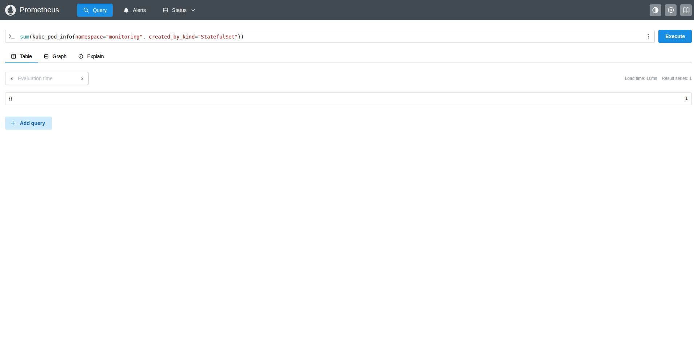

# Monitoring (Prometheus & Grafana)

Prometheus and Grafana, installed via Helm into a local (minikube) `monitoring`
namespace:

```
helm repo add prometheus-community https://prometheus-community.github.io/helm-charts
helm repo add grafana https://grafana.github.io/helm-charts
helm repo update

kubectl create namespace monitoring
helm install prom prometheus-community/prometheus -n monitoring
helm install grafana grafana/grafana -n monitoring
```

## Exercise 4.3: querying Prometheus

Access the Prometheus GUI by port-forwarding the service:

```
kubectl port-forward svc/prom-prometheus-server -n monitoring 9090:80
```

Then open http://localhost:9090 and run a query for the number of pods
created by StatefulSets in the `monitoring` namespace:

```
sum(kube_pod_info{namespace="monitoring", created_by_kind="StatefulSet"})
```

In this setup the result is `1` — `prom-alertmanager` is the only
StatefulSet-managed component here (`prometheus-server`,
`kube-state-metrics`, and `pushgateway` are Deployments, `node-exporter` is a
DaemonSet):


