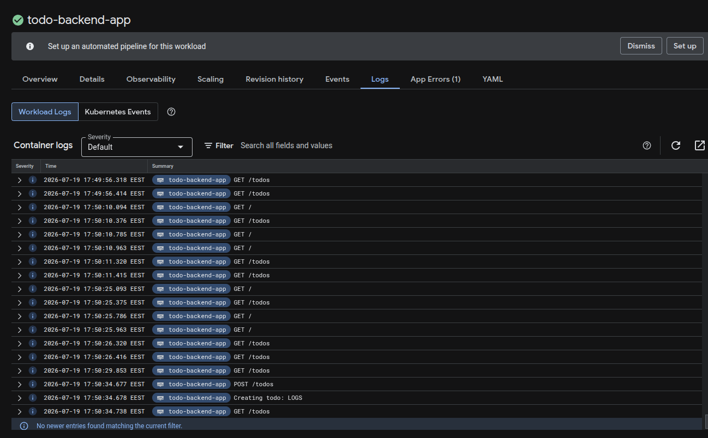

# The project

Kustomize configuration (`manifests/base` + `manifests/overlays/{minikube,gke}`)
for the course project: `todo-app`, `todo-backend`, `todo-postgres`,
`todo-cron`, `nats`, and `broadcaster` (see `../broadcaster/README.md`). See
each app's own directory for its source code and README.

Deployed to GKE via the GitHub Actions workflows in `.github/workflows/`:
feature branches get deployed directly into their own namespace (named after
the branch, torn down when the branch is deleted). `main` uses GitOps
instead (Exercise 4.8, see below).

## GitOps for main (Exercise 4.8)

Pushes to `main` no longer deploy directly. `.github/workflows/main.yaml`
still builds and pushes SHA-tagged images, but for `main` it only runs
`kustomize edit set image` in `manifests/overlays/gke` and commits the
updated `kustomization.yaml` back to the repo (using the workflow's default
`GITHUB_TOKEN`, so it doesn't re-trigger itself).

ArgoCD (`manifests/argocd/application.yaml`, same ArgoCD instance used for
`log_output`) watches that path on `main` and auto-syncs the `project`
namespace whenever the commit lands — no `kubectl apply` involved. Feature
branches keep the old direct-apply flow unchanged, since the exercise only
requires GitOps for `main`.

```bash
kubectl apply -f manifests/argocd/application.yaml
```

## Todo status broadcasting (Exercise 4.6)

`todo-backend` publishes a message to NATS (subject `todos`) whenever a
todo is created or marked done. The `broadcaster` service subscribes to
that subject using a NATS queue group, so it can be scaled to any number
of replicas without ever delivering the same message twice — verified at
6 replicas on the live cluster, where 3 new todos were each handled by
exactly one of the 6 pods. It forwards each event to an external webhook
as `{"user": "bot", "message": "..."}`.

## GKE Monitoring: application logs (Exercise 3.12)

GKE clusters have Cloud Logging/Monitoring enabled by default (the
`WORKLOADS` logging component was already active on `dwk-cluster`, no
extra setup needed). Application `stdout`/`stderr` is automatically
collected and viewable per-workload under **Kubernetes Engine →
Workloads → <workload> → Logs**, or via **Logging → Logs Explorer**
filtered by `resource.type="k8s_container"`.

Below is the `todo-backend-app` log around a todo being created — the
`POST /todos` request log immediately followed by the app's own
`Creating todo: ...` line:



## DBaaS vs DIY: Postgres (Exercise 3.9)

We currently run Postgres ourselves inside the cluster as a StatefulSet
backed by a dynamically-provisioned PersistentVolumeClaim (see
`manifests/base/todo-postgres.yaml`) — this is the "DIY" approach. The
alternative would be a Database as a Service, e.g. Google Cloud SQL for
PostgreSQL. Comparison below.

### DIY: StatefulSet + PVC (what we use today)

**Pros**

- Cheap: no managed-service premium, just the cost of the underlying GCE
  persistent disk plus compute on nodes we're already paying for — no
  separate billed instance.
- Fast to stand up: one StatefulSet + Service + PVC manifest, applied with
  the same `kubectl`/Kustomize flow as every other app, in seconds.
- Full control over the Postgres version, config, and extensions.
- Lives entirely inside our existing GitOps pipeline — no separate
  console or tool to learn; it's just another resource in `kustomize
  build`.

**Cons**

- We own all of the operations: patching, version upgrades, tuning,
  monitoring disk usage, connection pooling. None of it is automatic.
- Backups are entirely on us. Nothing exists today beyond the PVC itself
  — we'd have to build our own (e.g. a `pg_dump` CronJob to a GCS
  bucket, or PVC snapshots), and restoring from a plain disk snapshot is
  coarse (whole-volume, only as fresh as the last snapshot) unless we
  also build WAL archiving for real point-in-time recovery.
- No built-in high availability: one replica, one zone. If that pod's
  node or disk has a bad day, that's real downtime/data-loss risk.
- Storage growth means manually resizing the PVC.

### DBaaS: Google Cloud SQL for PostgreSQL

**Pros**

- Automated backups and point-in-time recovery out of the box — this is
  the biggest practical difference. Scheduled backups plus WAL archiving
  are built in; restoring to any point in time is a few clicks or one
  `gcloud sql` command, not something we have to engineer ourselves.
- Google handles patching, minor-version upgrades, storage autoresize,
  and optional automatic failover to a standby in another zone.
- Integrated monitoring/alerting via Cloud Monitoring and IAM-based
  access control instead of us managing Postgres roles/passwords by
  hand.
- Read replicas and cross-region replicas for scaling/DR are a checkbox,
  not a project.

**Cons**

- More expensive: the instance itself is billed continuously (vCPU +
  RAM) on top of storage, even at the smallest tier — real money instead
  of piggybacking on cluster nodes we already pay for.
- More setup work outside Kubernetes: provisioning the instance,
  networking (private IP or the Cloud SQL Auth Proxy/sidecar) so pods in
  GKE can reach it securely, and a separate IAM/service-account setup.
- Less control: a fixed set of supported Postgres versions/extensions.
- It's a system our Kubernetes tooling (`kubectl`, Kustomize) doesn't
  see at all — it breaks the "everything is one `kubectl apply` away"
  workflow the rest of this project uses.

### Conclusion

For this course project — low traffic, a learning exercise, and a todo
list nobody would truly miss if it vanished — the DIY StatefulSet
approach we already have is the pragmatic choice: cheap, fast to set up,
and it stays inside the same pipeline as everything else. For a real
production database with real users' data, Cloud SQL's automated
backups and point-in-time recovery alone would likely be worth the extra
cost — the difference between "we lost some test todos" and "we lost a
customer's data" is exactly the kind of risk a managed backup story is
built to remove.
